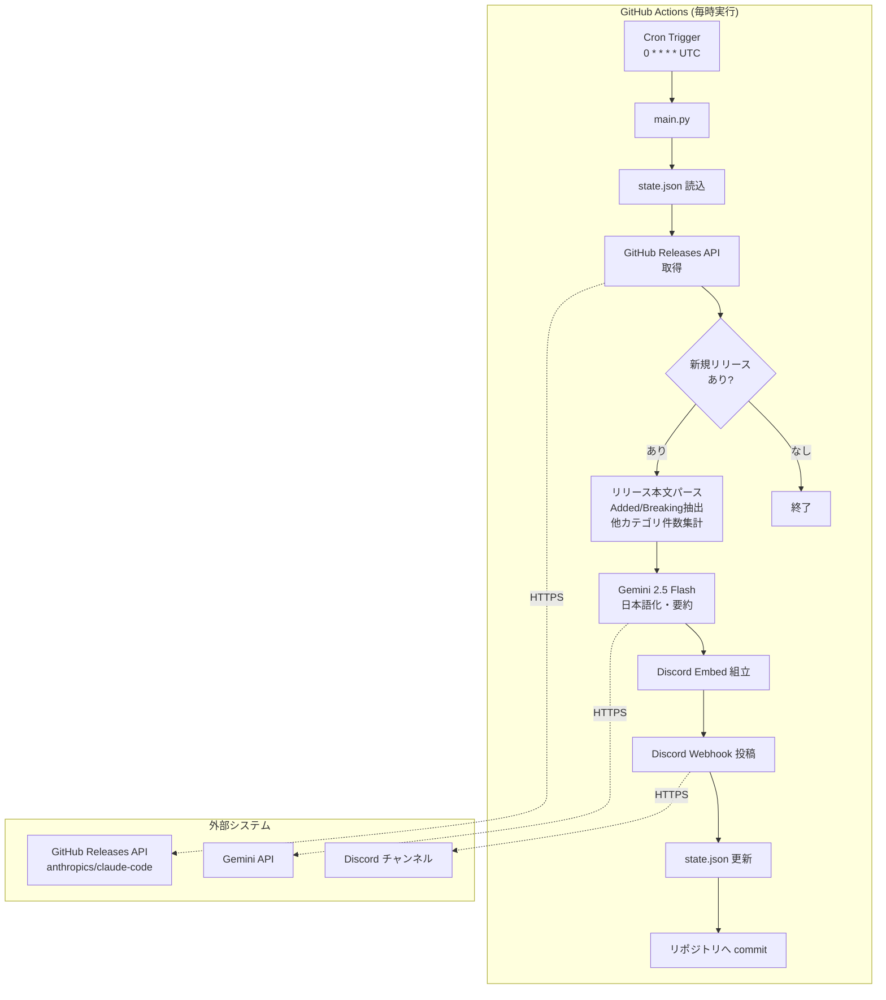
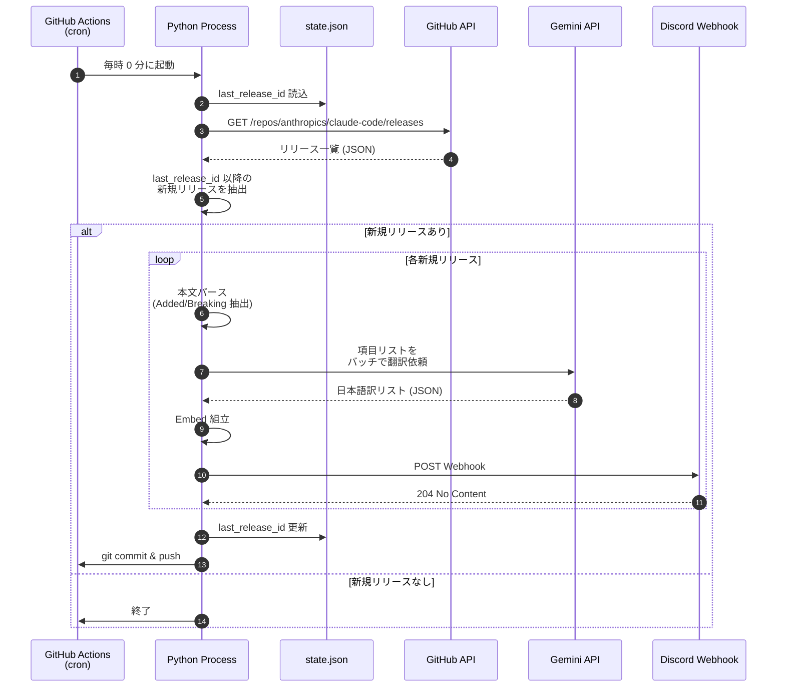

# Claude Code 更新情報 Discord 配信システム 仕様書

| 項目 | 内容 |
| --- | --- |
| 文書種別 | システム仕様書（PoC / MVP フェーズ） |
| 最終更新日 | 2026-04-24 |
| 対象システム | claude-code-discord-notifier |
| フェーズ | Phase 1（最小構成の立ち上げ） |

---

## 1. 目的とスコープ

本システムは、Anthropic 社が提供する Claude Code の新バージョンがリリースされた際に、その変更内容のうちユーザーにとって重要度の高い情報（新機能および Breaking Change）を抽出し、日本語化した上で Discord チャンネルに自動配信することを目的とする。Claude Code は現在 1 日に 1 回から 3 回のペースで継続的に更新されており、リリースノートの内容を都度確認する運用は現実的ではない。そこで、変更情報を自動収集・整形・配信する仕組みを構築することで、情報追跡にかかる負荷を恒常的に低減することを狙う。

Phase 1 のスコープは、Claude Code 本体（[anthropics/claude-code](https://github.com/anthropics/claude-code)）の公式 GitHub Releases を情報源とし、毎時ポーリングによって新規リリースを検知し、Discord Webhook 経由で整形済み Embed メッセージを投稿するまでとする。本システムは Phase 1 で所期の目的を完結的に達成できる設計とし、追加フェーズの検討は行わない。

## 2. 背景と設計方針の決定経緯

### 2.1 情報源の選定

Claude Code の変更情報を取得できる情報源として、公式 GitHub Releases、公式 GitHub リポジトリの `CHANGELOG.md`、公式ドキュメントの Changelog ページ（[code.claude.com/docs/en/changelog](https://code.claude.com/docs/en/changelog)）、npm レジストリ（`@anthropic-ai/claude-code`）、ネイティブバイナリ配信のマニフェスト、非公式のコミュニティ運営リソース（X アカウント [@ClaudeCodeLog](https://x.com/ClaudeCodeLog) や [marckrenn/claude-code-changelog](https://github.com/marckrenn/claude-code-changelog) 等）の複数が存在することを確認した。

これらの中から **GitHub Releases API を主たる情報源として採用する**。理由は次の通りである。第一に、公式かつリリース単位で情報が構造化されており、リリース ID、公開日時、本文を機械的に扱いやすい形式で取得できる。第二に、API は未認証でも毎時 60 リクエスト、認証付きで毎時 5,000 リクエストまで利用可能であり、毎時 1 リクエスト程度の利用であれば十分な余裕がある。第三に、公式ドキュメントの Changelog ページはリポジトリの `CHANGELOG.md` から自動生成されていることが公式に明記されており、Releases と実質的に同じ情報を保持しているため、どちらを選んでも情報の欠落は生じない。

npm レジストリは 2025 年後半以降、公式の推奨インストール手段がネイティブバイナリ配信に移行したこと（[公式セットアップドキュメント](https://code.claude.com/docs/en/setup)）を受けて非推奨扱いとなっているため、バージョン検知の代替手段としては不採用とする。ネイティブバイナリ配信のマニフェストは署名済みのバージョン情報のみを含み、変更内容本文を持たないため、本件の用途には適さない。非公式リソースは依存リスクがあるため、Phase 1 では利用しない。

### 2.2 運用基盤の選定

運用基盤の候補として、ノーコードツール（MonitoRSS、IFTTT、Zapier 等による RSS 転送）、GitHub Actions、Cloudflare Workers の 3 系統を比較検討した。

当初はノーコード構成を最速の立ち上げ手段として位置づけたが、要件の中核である「新機能と Breaking Change のみを抽出する」処理は、GitHub Releases のフィード 1 エントリ内に `Added` / `Fixed` / `Improved` / `Changed` が混在する構造上、ノーコードツールのキーワードフィルタでは実現できない。したがってノーコード案は要件と整合しないと判断した。

Cloudflare Workers は、Cron Triggers による定期実行が無料プラン内で提供されること、および別プロジェクトでの学習的価値があることから有力な選択肢であった。しかし、無料プランの 1 呼び出しあたり CPU 時間 10 ms という制約が、リリース本文の肥大化時（過去には v2.1.72 のように長大なリリースノートを伴う例がある）にリスクとなり得ること、TypeScript を主言語とするためユーザー方針である Python 中心のスタックと乖離することから、Phase 1 では採用を見送る。

最終的に **GitHub Actions + Python の構成を採用する**。Public リポジトリであれば Actions の利用料は[無料かつ無制限](https://docs.github.com/billing/managing-billing-for-github-actions/about-billing-for-github-actions)であり、Python による実装はユーザーのスタック方針（Python 基本、依存管理に uv を使用）と整合する。CPU 時間や実行時間の制約が実質的に存在しないため、リリース本文の長大化リスクにも耐える。

### 2.3 GitHub Actions の 60 日停止問題への対処

GitHub Actions のスケジュール実行は、60 日間リポジトリ側にアクティビティがない場合に自動停止する仕様がある。本システムにおいては、新規リリース検知時に状態ファイル（`state.json`）をリポジトリへコミットする設計としているため、Claude Code の現在のリリース頻度（1 日 1 回から 3 回）が継続する限り、この仕様に抵触することは実質的に発生しない。

ただし万一の Claude Code 側のリリース停止や長期休暇期間に備えた保険として、週次で空コミットを打つ別ワークフロー（keepalive）を併設する。この二段構えにより、運用者の手動介入なしに恒久的な自動実行を保証する。

### 2.4 要約・翻訳エンジンの選定

日本語化および要約処理には、**Gemini 2.5 Flash を採用する**。[2026 年 4 月時点の無料枠](https://ai.google.dev/gemini-api/docs/rate-limits)は 1 分あたり 10 リクエスト、1 日あたり 250 リクエストであり、本システムの想定使用量（1 日あたり最大でも 10 リクエスト程度）に対して大幅な余裕がある。2025 年 12 月および 2026 年 4 月に実施された無料枠の段階的縮小により、かつての Flash-Lite 側 1,000 RPD から Flash 側 250 RPD へと条件が変動しているが、本システムの利用量水準では依然として無料枠内に十分収まる。

Flash を Flash-Lite に対して選定する判断の根拠は次の通りである。第一に、リリースノートの項目翻訳では文脈把握と用語選択の適切性が品質に直結するため、Flash-Lite よりも推論能力の高い Flash が安定した翻訳品質を提供する。第二に、Flash は Thinking 機構を持つが、翻訳タスクのような単純変換では `thinking_budget=0` に設定することで Flash-Lite と同等のレイテンシとコストで運用可能である。第三に、万一の有料化時にも従量課金は極めて安価（入力 100 万トークンあたり 0.30 ドル、出力 100 万トークンあたり 2.50 ドル）であり、本システムの月間利用量では月額数十円オーダーに収まるため、コスト面のリスクは無視できる。

なお Google は 2025 年 12 月および 2026 年 4 月に Gemini API の無料枠を段階的に縮小してきており、今後も縮小される可能性を考慮する必要がある。本仕様では有料化後のコストも許容可能な水準であることを確認済みとし、無料枠の変動は運用継続性に影響しないものと整理する。

## 3. システム全体構成

本システムは、GitHub Actions のワークフロー上で 1 時間ごとに起動する Python プロセスとして実装される。プロセスは GitHub Releases API から最新のリリース情報を取得し、前回処理時点との差分を検出した上で、Gemini API を通じて日本語要約を生成し、Discord Webhook に Embed 形式で投稿する。処理後、最終処理済リリースの識別子を状態ファイルとしてリポジトリへコミットし、次回実行時の基準として利用する。



### 3.1 処理シーケンス

1 回のワークフロー実行における処理の流れは次の通りである。



## 4. 機能仕様

### 4.1 情報取得

GitHub Releases API のエンドポイント `https://api.github.com/repos/anthropics/claude-code/releases` に対して GET リクエストを発行し、直近のリリース一覧を取得する。デフォルトでは 30 件が返却されるため、通常運用（毎時実行）において未処理のリリースを取りこぼすことは想定されない。万一ワークフローが長時間停止し 30 件を超える未処理リリースが発生した場合は、APIのページネーションにより追加取得する設計とする。

認証には GitHub の Fine-grained Personal Access Token を用いる。スコープは「Public Repositories (read-only)」のみに限定し、最小権限の原則に従う。認証を行うことで未認証の毎時 60 リクエスト制限から毎時 5,000 リクエスト制限へと緩和され、将来的な処理拡張時の余裕が確保される。

### 4.2 新規リリースの検知

リポジトリ内に格納された `state.json` には、直近に処理したリリースの ID とタグ名が記録される。取得した API レスポンスを公開日時の昇順でソートし、`state.json` 内の `last_release_id` より新しいリリースのみを処理対象として抽出する。初回実行時（`state.json` が存在しない、または空の場合）は、誤って過去分を大量配信することを避けるため、**直近 1 件のみを処理対象とし、それ以前は「処理済」とみなす**。

### 4.3 本文のパースと抽出

Claude Code のリリース本文は、箇条書き形式で変更点が列挙されている。各項目は概ね次のいずれかの動詞で始まる規則性を持つ。`Added`、`Fixed`、`Improved`、`Changed`、`Removed`、`Deprecated`、および破壊的変更を示す `Breaking` 等である。

本システムでは、項目の先頭動詞および `[VSCode]` のようなプレフィックスを正規表現で識別し、次の 2 系統に分類する。**本文に含めて配信する項目**は、`Added` で始まる新機能追加と、`Breaking` または `Removed`・`Deprecated` に該当する破壊的変更である。**件数のみを集計する項目**は、`Fixed`・`Improved`・`Changed` 等それ以外の全カテゴリとする。分類が曖昧な項目については、保守的に「件数のみ」側に倒す方針とする。

パース処理はサードパーティ製 Markdown パーサーを用いず、リリース本文に対する行単位の正規表現マッチによって実装する。Claude Code のリリース本文は比較的一貫した形式で記述されており、重量級パーサーを導入する必要性は低い。

### 4.4 要約および日本語化

抽出された項目を Gemini 2.5 Flash に渡し、日本語の箇条書きへと変換する。プロンプト設計の詳細は「5. Gemini プロンプト設計」章に定めるが、本節では設計の基本方針のみを示す。

Claude Code のリリースノートには MCP、subagent、hook、skill、sandbox、permission rule、plugin、slash command といった固有概念が頻出する。これらを機械的に日本語化するとかえって可読性が下がるため、**プロンプト上で「固有の製品用語は英語表記のまま残す」ことを明示する**。加えて、原文の意味を逸脱した脚色や推測を避けるため、「原文の箇条書きを短い日本語の箇条書きに直訳すること、1 項目は概ね 80 文字以内に収めること、原文にない情報を追加しないこと」を指示する。

要約の粒度は、項目別の箇条書き翻訳形式（プロンプト入力：原文の箇条書き配列 → プロンプト出力：日本語の箇条書き配列）とする。1 リリースにつき 1 回の API 呼び出しで全項目をバッチ翻訳することで、レート消費を最小化する。リリース単位で段落要約する方式は情報の圧縮度が高すぎ、ハイブリッド方式はプロンプトが複雑化して出力のブレが大きくなるため、Phase 1 では採用しない。

### 4.5 Discord への配信

Discord Webhook に対して Embed 形式のメッセージを POST する。Embed の構造は次の通り定める。

**タイトル**には `Claude Code vX.Y.Z` 形式でバージョン番号を記載し、リリース URL をハイパーリンクとして付与する。**色**は変更内容のカテゴリに応じて 3 段階に分ける。Breaking Change を含む場合は赤系（16 進 `0xE74C3C`）、Breaking はなく新機能のみを含む場合は緑系（`0x2ECC71`）、新機能も Breaking もない場合は灰系（`0x95A5A6`）とする。**Description** には変更の全体像を 1 行で示す（例：「新機能 3 件、Breaking 0 件、その他修正 15 件」）。**フィールド**として「新機能」「Breaking Changes」を個別に設け、該当項目がある場合のみ箇条書きで日本語訳を表示する。**フッター**には公開日時（JST 表記）を記載する。

Discord Embed の Description および各フィールドには文字数上限が定められており、特に `description` の 4,096 字、1 つの `field.value` の 1,024 字、Embed 全体の 6,000 字という制約に留意する必要がある。項目数が多く上限を超える場合は、重要度の高い順に 5 項目程度までを表示し、残件は「他 N 件」として省略する。完全な内容は Embed タイトルのリンクから原文を参照する運用とする。

### 4.6 状態管理とコミット

新規リリースを 1 件以上処理した場合、`state.json` 内の `last_release_id` および `last_tag_name`、`last_published_at` を最新値に更新し、`git commit` と `git push` を行う。コミットメッセージは `chore(state): update last_release_id to vX.Y.Z` 形式で統一する。この定期的なコミットによって、GitHub Actions の 60 日非アクティブによるスケジュール停止を実質的に回避する。

万一配信処理の途中でエラーが発生した場合は、状態ファイルを更新せずにワークフローを異常終了させる。これにより、次回実行時に同じリリースが再処理され、重複投稿または取りこぼしを防ぐ設計とする。冪等性の観点からは、Discord 投稿が成功したリリースまでを部分的にコミットする実装が望ましいため、リリース単位でトランザクション的に処理する（1 件投稿成功 → 即 state 更新 → commit）方式を採用する。

## 5. Gemini プロンプト設計

本章では、4.4 節で述べた要約・日本語化処理の中核となる Gemini 2.5 Flash へのプロンプト設計を定める。設計目標は、Claude Code のリリースノート項目を対象に、翻訳品質の安定性、API 呼び出し数の最小化、および故障モード（出力の途中切断・件数不整合・日本語化されるべきでない用語の誤訳）への耐性を同時に確保することである。

### 5.1 設計原則

本プロンプト設計は次の 4 原則に基づく。

第一に、**翻訳単位のバッチ化**を徹底する。1 つのリリースから抽出された `Added` 系および `Breaking` 系の全項目を 1 回の API 呼び出しで処理する。これにより API 呼び出し数は「リリース数 × 1」に縮減され、`[10 RPM / 250 RPD](https://ai.google.dev/gemini-api/docs/rate-limits)` の無料枠に対して大幅な余裕を確保する。

第二に、**構造化出力（`response_mime_type="application/json"` ＋ `response_schema`）**を用いる。Gemini 2.5 Flash は Pydantic モデルをそのまま `response_schema` に渡せるため、出力はスキーマに準拠した JSON として受領でき、後処理での正規表現パース等は不要になる。これにより出力フォーマットのブレに起因する障害を構造的に排除する。

第三に、**`thinking_budget=0` で Thinking 機構を無効化する**。本タスクは多段推論を要さない項目単位の翻訳であるため、Thinking を有効化しても品質向上は限定的であり、むしろレイテンシと（有料化時の）トークン課金を押し上げる。設計上はこの設定を既定とし、将来的に品質評価で必要と判断された場合にのみ動的（`thinking_budget=-1`）に切り替える運用余地を残す。

第四に、**防御的後検証**を実装側で併用する。具体的には、入力項目数と出力項目数の一致確認、各出力項目の最大文字数確認、`finish_reason` が `STOP` であっても出力末尾が途中で途切れていないかの検査を行う。Gemini 2.5 Flash では、ユーザー報告事例として `finish_reason="STOP"` を返しながら出力が途中で切断される事象（silent truncation）が継続的に報告されているため、LLM 呼び出し結果を無条件に信頼しない設計とする。

### 5.2 プロンプト全文

Gemini への指示は、システム指示（`system_instruction`）と入力本体（`contents`）の 2 層で構成する。システム指示は翻訳ルールを恒常的に宣言し、入力本体には当該リリースから抽出した英語原文リストを JSON 文字列として渡す。

#### 5.2.1 システム指示（`system_instruction`）

以下の内容を固定文字列としてコードに埋め込み、毎回の呼び出しで同一のものを使用する。

```text
あなたは Anthropic 社の AI コーディングエージェント「Claude Code」のリリースノートを日本語に翻訳する専門翻訳者です。与えられた英語の箇条書き項目を、日本の開発者向けの簡潔な日本語に翻訳してください。

## 役割
- 入力: Claude Code リリースノートの箇条書き項目（英語）の配列
- 出力: 各項目に対応する日本語訳の配列（入力と同じ件数・同じ順序）

## 翻訳ルール

### R1. 意味保存
- 原文の意味を変えない。推測による情報追加・脚色・例示の拡張・補足説明の付与はいずれも禁止する。
- 原文に書かれていない効果や用途を訳文に含めない。

### R2. 先頭ラベルの保持
- 項目の先頭にある分類ラベル（Added / Fixed / Improved / Changed / Removed / Deprecated / Breaking など）は英語のまま残し、その後に半角スペースを挟んで日本語訳を続ける。
- 例: "Added support for X" → "Added X に対応"

### R3. 製品固有用語の保持（以下のリストに含まれる語は翻訳せず英語のまま残す）
MCP, subagent, hook, skill, sandbox, permission rule, plugin, slash command, tool, artifact, agent, SDK, CLI, API, SSE, OAuth, prompt, context, token, session, workflow, Claude, Claude Code, Anthropic, GitHub, VSCode, IDE, terminal, shell, bash, zsh, fish, thinking, reasoning, tool use, streaming, tokenizer, extended thinking, system prompt, Bedrock, Vertex AI

上記以外でも、明らかにコマンド名・フラグ名・ファイル名・環境変数名・関数名・設定キー・HTTP ステータス・ライブラリ名である語は、無理に日本語化せず原文のまま保持する。

### R4. コードスパンの保持
- Markdown のバッククォート（`）で囲まれた部分は、内容・記号ともに原文のまま変更しない。
- 例: `--output-format` → `--output-format`

### R5. 文字数制限
- 1 項目あたり、ラベル部分を除いた日本語本文は概ね 80 文字以内に収める。
- 原文が長大な場合は、"we've"、"now you can"、"as part of our effort to" などの導入表現を省いて本質的な変更内容のみを訳す。

### R6. 文体
- 常体（だ・である調）ではなく、体言止めまたは「〜に対応」「〜を改善」「〜を削除」などの名詞句または簡潔な動詞句で締める。
- 敬体（です・ます調）は用いない。

### R7. 判断不能時の挙動
- 訳語が明らかに存在せず、カタカナ化も不自然な語は原文のまま残す。
- 文脈が不明瞭な場合は、推測を交えず原文に最も忠実な直訳を選ぶ。

## 翻訳例

### 例 1
入力: "Added support for MCP resources with mime type image/png in conversations."
出力: "Added 会話内で MIME タイプ image/png の MCP resources に対応"

### 例 2
入力: "Breaking: Removed the deprecated --legacy flag. Use --output-format instead."
出力: "Breaking 非推奨の `--legacy` フラグを削除。代わりに `--output-format` を使用"

### 例 3
入力: "Added /compact slash command now preserves pinned system prompts across compactions."
出力: "Added `/compact` slash command が compaction をまたいで pinned system prompt を保持"

## 出力形式
JSON オブジェクトを返す。キーは `translations` のみで、値は入力と同じ長さ・同じ順序の日本語訳文字列の配列とする。余計なキーや説明文・コードフェンスは一切付けないこと。
```

#### 5.2.2 入力本体（`contents`）

入力本体は、抽出済み英語項目リストを JSON 形式で埋め込んだ定型プロンプトとする。項目数が 0 件の場合はそもそも API を呼び出さないため、以下は 1 件以上を保証した上で用いる。

```text
以下の項目を、上記ルールに従って日本語に翻訳してください。

入力項目（英語、{N} 件）:
{JSON_ARRAY}

出力: 同じ順序・同じ件数の日本語訳を `translations` 配列で返してください。
```

`{N}` には項目数、`{JSON_ARRAY}` には英語原文の配列を `json.dumps(..., ensure_ascii=False)` で文字列化したものを代入する。件数を明示的にプロンプトに含めることで、出力配列の長さ不整合に対するモデル側の自己検知を促す副次効果も期待できる。

### 5.3 出力スキーマ（Pydantic）

`response_schema` には以下の Pydantic モデルを渡す。`google-genai` SDK は Pydantic モデルを自動的に JSON Schema に変換して API に渡すため、追加のスキーマ定義ファイルは不要である。

```python
from pydantic import BaseModel, Field


class TranslationResponse(BaseModel):
    """Gemini から受領する翻訳結果の構造。"""

    translations: list[str] = Field(
        description=(
            "入力された英語原文と同じ長さ・同じ順序の日本語訳配列。"
            "各要素はラベル + 半角スペース + 日本語本文（80 文字以内）の形式。"
        ),
    )
```

### 5.4 呼び出しパラメータ

Gemini API 呼び出し時の主要パラメータは下表の通り固定する。

| パラメータ | 設定値 | 理由 |
| --- | --- | --- |
| `model` | `gemini-2.5-flash` | 本仕様での採用モデル |
| `response_mime_type` | `application/json` | 構造化出力の強制 |
| `response_schema` | `TranslationResponse`（Pydantic） | 出力形式の型保証 |
| `thinking_config.thinking_budget` | `0` | 翻訳タスクでは Thinking を無効化してコスト・レイテンシを最適化 |
| `temperature` | `0.2` | 翻訳の一貫性を優先しつつ、固着した誤訳を回避する程度の低温度 |
| `max_output_tokens` | `8192` | 1 リリース最大 50 項目程度を想定し、各項目最大 80 文字の日本語 + JSON オーバーヘッドで十分な余裕 |
| `candidate_count` | `1` | 単一候補のみ取得 |

### 5.5 呼び出しコード例

本プロンプト設計に基づく Python 実装の骨子を以下に示す。実運用では `summarizer.py` モジュールに配置する想定である。

```python
import json
from google import genai
from google.genai import types
from pydantic import BaseModel, Field


SYSTEM_INSTRUCTION = """\
あなたは Anthropic 社の AI コーディングエージェント「Claude Code」のリリースノートを
...（5.2.1 節のシステム指示全文）...
"""


class TranslationResponse(BaseModel):
    translations: list[str] = Field(...)


def translate_release_items(
    client: genai.Client,
    items: list[str],
) -> list[str]:
    """抽出済み英語項目リストを日本語訳リストに変換する。

    Args:
        client: 事前に API キーで初期化された google-genai クライアント。
        items: Added / Breaking 系の抽出済み英語項目リスト（1 件以上）。

    Returns:
        入力と同じ長さ・同じ順序の日本語訳リスト。

    Raises:
        ValueError: 出力件数が入力と一致しない、または出力が空の場合。
    """
    if not items:
        raise ValueError("items は 1 件以上である必要がある")

    user_prompt = (
        f"以下の項目を、上記ルールに従って日本語に翻訳してください。\n\n"
        f"入力項目（英語、{len(items)} 件）:\n"
        f"{json.dumps(items, ensure_ascii=False, indent=2)}\n\n"
        f"出力: 同じ順序・同じ件数の日本語訳を `translations` 配列で返してください。"
    )

    response = client.models.generate_content(
        model="gemini-2.5-flash",
        contents=user_prompt,
        config=types.GenerateContentConfig(
            system_instruction=SYSTEM_INSTRUCTION,
            response_mime_type="application/json",
            response_schema=TranslationResponse,
            thinking_config=types.ThinkingConfig(thinking_budget=0),
            temperature=0.2,
            max_output_tokens=8192,
            candidate_count=1,
        ),
    )

    # 件数整合と truncation の検証
    parsed: TranslationResponse = response.parsed
    if len(parsed.translations) != len(items):
        raise ValueError(
            f"出力件数不整合: 入力 {len(items)} 件 / 出力 "
            f"{len(parsed.translations)} 件"
        )
    if response.candidates[0].finish_reason.name != "STOP":
        raise ValueError(
            f"異常な finish_reason: {response.candidates[0].finish_reason}"
        )

    return parsed.translations
```

### 5.6 故障モードと対応方針

本プロンプトおよび呼び出し実装で想定する主な故障モードと、それぞれへの対応方針を下表に示す。

| 故障モード | 検知方法 | 対応 |
| --- | --- | --- |
| 出力件数が入力と不一致 | `len(parsed.translations) != len(items)` で検知 | 当該リリース処理を異常終了。`state.json` を更新せず次回再処理に委ねる。 |
| Silent truncation（`finish_reason=STOP` だが出力途中切断） | 件数不整合として 5.6.1 に同じ／または個別項目の末尾が不自然に途切れていないかの追加検査 | 同上。必要に応じ `max_output_tokens` を引き上げてリトライ。 |
| 固有用語の誤訳（例: MCP → 「メッセージ制御プロトコル」） | 後検証として保持語リストに含まれる語が原文に存在するのに訳文に含まれない場合を検知（`WARNING` ログ） | 本バージョンではログ出力のみとし、Discord 配信は続行。頻発時はプロンプトの保持語リスト更新で対応。 |
| 文字数超過（80 文字を大きく超える） | 出力項目ごとに長さ検査 | 100 文字以上の場合は `WARNING` ログを出し、Discord 側の `field.value` 1,024 字上限に抵触しない限りそのまま配信。 |
| レート制限超過（HTTP 429） | SDK が `ClientError` を投げる | 当該実行をスキップし、1 時間後の次回実行に委ねる（8.2 節参照）。 |
| API キー無効・権限エラー（HTTP 401/403） | SDK が `ClientError` を投げる | ワークフローを異常終了させ、Actions の通知で運用者に知らせる。 |
| 一時的な 5xx エラー | HTTP ステータスコード | 指数バックオフで最大 3 回リトライ（8.2 節参照）。 |

### 5.7 プロンプト変更時の検証方針

プロンプト文面を変更する際は、過去の長大なリリース（例: v2.1.72、v2.1.77）を用いた回帰セットに対して翻訳を実行し、出力の目視確認を行う。評価は定性的な観点（意味の忠実性、固有用語の保持、文字数制限の遵守、誤った敬体化の不在）で行い、明確な劣化がない場合にのみ本番へ適用する。Phase 1 ではこの評価は手動運用とし、自動化は将来的な改善項目として位置付ける。

## 6. 技術スタック

| レイヤ | 採用技術 | 備考 |
| --- | --- | --- |
| 実行基盤 | GitHub Actions | Public リポジトリで利用料無料 |
| 言語 | Python 3.12 | ユーザー方針に準拠 |
| 依存管理 | uv | `pyproject.toml` + `uv.lock` による lockfile 管理 |
| HTTP クライアント | httpx | 同期 API で十分、型安全性と可読性重視 |
| バリデーション | pydantic | API レスポンス・state ファイル・Gemini 出力スキーマの型定義 |
| Gemini クライアント | google-genai（公式 SDK） | Gemini 2.5 Flash を呼び出し |
| テスト | pytest + pytest-mock | 外部 API はモック化 |
| Lint / Format | ruff | 開発時のみ |
| 状態保持 | リポジトリ内 `state.json` | Git 経由で永続化 |
| ロギング | Python 標準 logging | Actions のジョブログに出力 |

## 7. リポジトリおよびファイル構成

```
claude-code-discord-notifier/
├── .github/
│   └── workflows/
│       ├── notify.yml           # 毎時実行ワークフロー
│       └── keepalive.yml        # 週次の空コミット保険
├── src/
│   └── notifier/
│       ├── __init__.py
│       ├── main.py              # エントリポイント
│       ├── config.py            # 環境変数読込とバリデーション
│       ├── github_client.py     # GitHub Releases API クライアント
│       ├── parser.py            # 本文パース・カテゴリ分類
│       ├── summarizer.py        # Gemini API クライアントとプロンプト
│       ├── discord_client.py    # Discord Webhook クライアント
│       ├── state.py             # state.json の読み書き
│       └── models.py            # pydantic モデル定義
├── tests/
│   ├── test_parser.py
│   ├── test_state.py
│   ├── test_summarizer.py
│   └── fixtures/
│       └── release_v2_1_81.json # サンプルリリース本文
├── state.json                   # 最終処理済リリースの記録
├── pyproject.toml
├── uv.lock
├── .gitignore
├── .python-version
└── README.md
```

## 8. 環境変数とシークレット

本システムで使用する機密情報はすべて GitHub リポジトリの Actions Secrets として登録し、ワークフロー実行時のみ環境変数として注入する。

| 名称 | 用途 | 取得元 |
| --- | --- | --- |
| `GITHUB_PAT` | GitHub Releases API 認証 | GitHub Fine-grained PAT（Public Repositories read-only） |
| `GEMINI_API_KEY` | Gemini API 認証 | Google AI Studio |
| `DISCORD_WEBHOOK_URL` | Discord チャンネルへの投稿先 | Discord サーバー設定の連携サービス |

Actions ワークフロー内で `git push` を行うため、デフォルトで提供される `GITHUB_TOKEN` を利用し、リポジトリへの書き込み権限を `contents: write` として明示的に付与する。

## 9. 運用仕様

### 9.1 実行スケジュール

メインワークフロー（`notify.yml`）は `cron: '0 * * * *'`（UTC、毎時 0 分）で実行する。Claude Code のリリースが世界時間のどの時間帯に発生しても概ね 1 時間以内には検知・配信される粒度である。配信のリアルタイム性を重視するため、日次ダイジェスト方式は採用しない。

keepalive ワークフロー（`keepalive.yml`）は `cron: '0 0 * * 0'`（UTC、毎週日曜 0 時）で実行する。本ワークフローはリポジトリに対して空コミットを生成することで GitHub Actions の 60 日非アクティブ停止を防止する保険として機能する。通常運用下ではメインワークフローによる `state.json` 更新コミットが頻繁に発生するため、keepalive が実際に機能する場面は稀であるが、Claude Code のリリース停止期間などに備えて常設する。

### 9.2 エラーハンドリング

GitHub API、Gemini API、Discord Webhook のいずれかで一時的な障害（HTTP 5xx、タイムアウト等）が発生した場合は、指数バックオフを用いて最大 3 回までリトライする。3 回とも失敗した場合はワークフローを異常終了させ、GitHub Actions の通知機構（設定により Email 等）で運用者に通知する。状態ファイルはこの時点で更新されないため、次回実行時に同じリリースが再処理される。

Gemini API が rate limit 超過（HTTP 429）を返した場合は、単純なリトライでは回復しない可能性が高いため、当該実行をスキップして次回 1 時間後の実行に委ねる。Claude Code のリリース頻度と無料枠の水準を考慮すれば、rate limit 到達は通常発生しないが、発生した場合の安全弁として設計しておく。

Gemini 出力に関する故障モード（件数不整合、silent truncation 等）の具体的な検知・対応は 5.6 節に定める方針に従う。

### 9.3 初回セットアップ手順

運用開始時の手順は次の通り。リポジトリを新規作成（Public 推奨、課金回避のため）、本仕様に基づきコードを配置し、Actions Secrets に 3 種のシークレットを登録、`state.json` を空の状態で初期化、Actions タブからワークフローを手動実行（`workflow_dispatch` トリガー）して疎通確認、問題なければスケジュール実行に委ねる、という流れとなる。初回実行では最新 1 件のみが処理対象となり、過去分の遡及配信は発生しない設計である。

## 10. コストと制約

Public リポジトリで運用する限り、GitHub Actions の標準ランナーは無料かつ実行時間制限なしで利用可能である。Gemini 2.5 Flash も、2026 年 4 月時点の無料枠 250 RPD に対して本システムの使用量は最大でも 1 日 10 リクエスト程度であり、無料枠内に十分収まる。Discord Webhook の利用は無料である。したがって**本システムの運用コストは実質ゼロ**である。

将来的な制約として留意すべき点は次の通り。Gemini API の無料枠は 2025 年 12 月および 2026 年 4 月に段階的に縮小された経緯があり、今後さらに縮小される可能性がある。仮に無料枠が撤廃された場合でも、Flash の従量課金は入力 100 万トークンあたり 0.30 ドル、出力 100 万トークンあたり 2.50 ドル（2026 年 4 月時点、[Gemini Developer API 公式価格表](https://ai.google.dev/gemini-api/docs/pricing)）と安価であり、本システムの想定利用量（1 日あたり最大でも入力 30K トークン・出力 10K トークン程度）では月額換算でも 1 ドル未満に収まる。したがって、有料化のリスクは事業継続性に実質的な影響を与えない。

GitHub API の未認証レート制限は毎時 60 リクエストであるが、認証済 PAT を利用することで毎時 5,000 リクエストまで拡張されるため、毎時 1 リクエスト程度の本システムでは制限に到達する現実的可能性はない。

## 11. 確定事項サマリー

本仕様書で確定した主要な意思決定事項を、参照のために以下に集約する。

| 項目 | 確定内容 |
| --- | --- |
| 情報源 | GitHub Releases API（`anthropics/claude-code`） |
| 実行基盤 | GitHub Actions（Public リポジトリ） |
| 言語および依存管理 | Python 3.12 + uv |
| 実行頻度 | 毎時 0 分（UTC） |
| 配信対象 | `Added`（新機能）および `Breaking` / `Removed` / `Deprecated` の本文配信。その他は件数のみ description に表示 |
| 要約粒度 | 項目別の箇条書き翻訳をリリース単位でバッチ処理 |
| 翻訳方針 | 固有の製品用語（MCP、hook、skill 等）は英語のまま保持 |
| LLM | Gemini 2.5 Flash |
| Gemini 呼び出し方式 | 構造化出力（`response_mime_type=application/json` + Pydantic スキーマ）、`thinking_budget=0`、`temperature=0.2` |
| 配信フォーマット | Discord Embed（Breaking 含む赤、新機能のみ緑、その他灰） |
| 状態管理 | リポジトリ内 `state.json` を Actions から commit |
| 60 日停止対策 | `state.json` 更新 commit による自動維持 + 週次 keepalive ワークフロー |
| 認証 | GitHub Fine-grained PAT（Public Repositories read-only） |
| コスト | 実質ゼロ |

以上をもって Phase 1 の実装に着手可能な状態とする。
