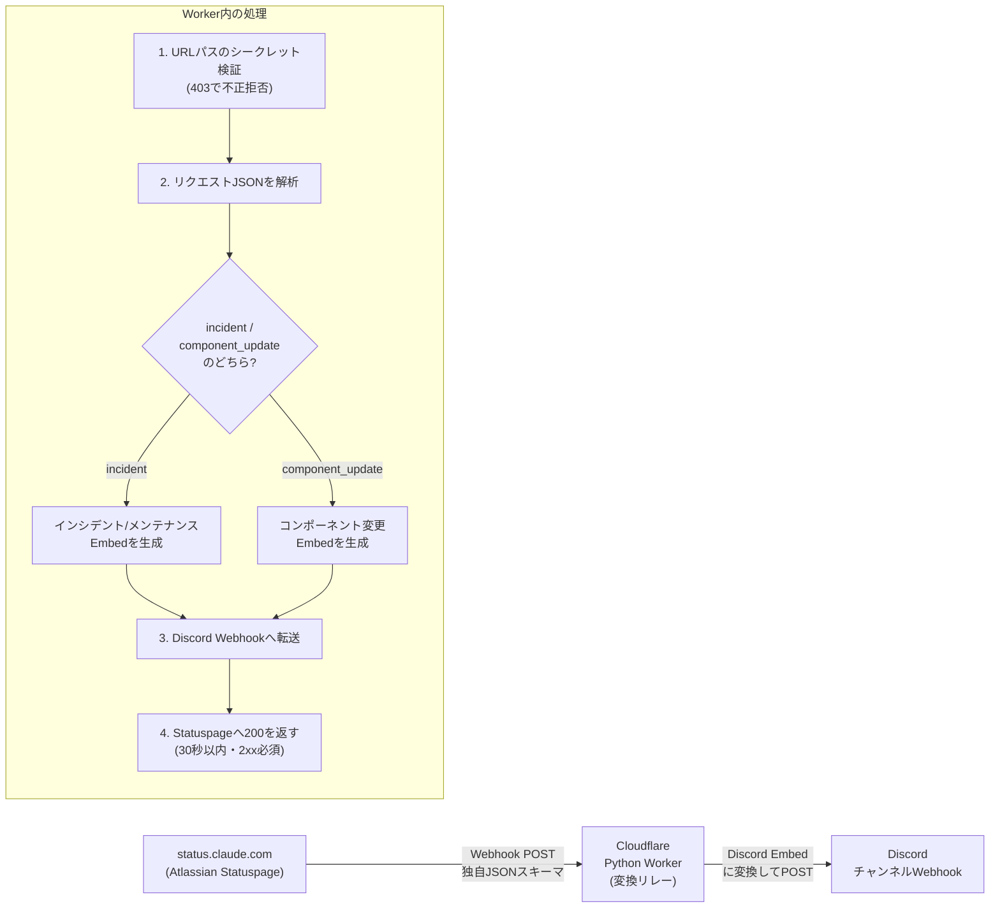
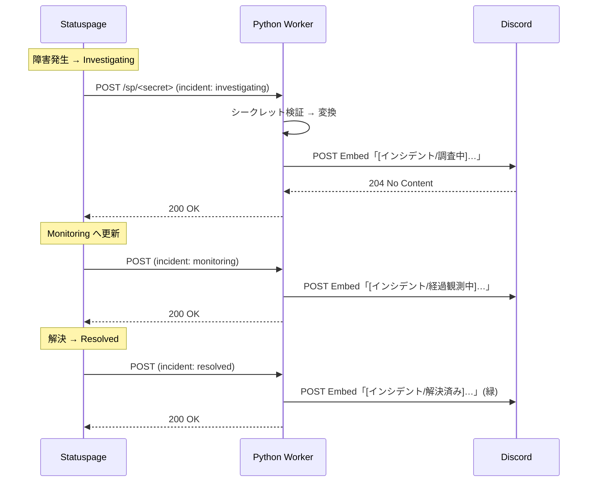
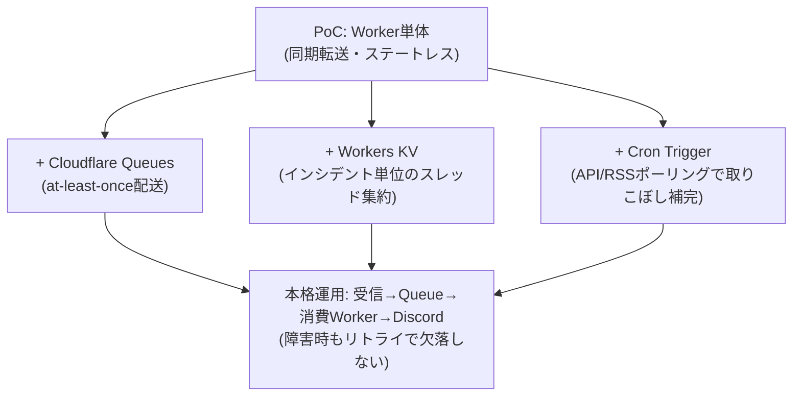

# Claude Status のインシデントを Discord へ流す実装ガイド

Statuspage（`status.claude.com`）の Webhook を、Cloudflare Python Workers で受け取り、日本語のリッチ Embed に変換して Discord チャンネルへ転送する構成の手順書です。本ガイドのコードは、Statuspage 公式ドキュメントに記載された実際のペイロード形式に対して uv 仮想環境でテスト済みです。

---

## 0. 前提として採用した既定値

事前確認のうち未回答だった運用項目について、以下の推奨案を既定として採用しています。いずれも環境変数または設定値で後から変更できます。

| 項目 | 採用した既定値 |
| --- | --- |
| Discord Webhook URL | 利用者が発行し、Worker のシークレット `DISCORD_WEBHOOK_URL` に格納 |
| 重大度フィルタ | 全件転送（`MIN_IMPACT=none`）。運用開始後に `minor`/`major`/`critical` へ引き上げ可能 |
| メンション | `CRITICAL_ROLE_ID` を設定した場合のみ、`critical` インシデントでそのロールをメンション。未設定なら通常投稿 |
| エンドポイント保護 | URL パスに推測困難なシークレットを埋め込み（`/sp/<RELAY_SECRET>`）。不一致は 403 |
| 更新のまとめ方 | インシデント更新ごとに新規メッセージ（ステートレス） |
| ホスティング | Cloudflare Python Workers（オープンベータ）、`*.workers.dev` サブドメイン |

---

## 1. 全体像

最大のポイントは **Statuspage の Webhook ペイロードは Discord が受け付ける形式と非互換** である点です。Discord の受け口はネイティブ形式（`content`/`embeds`）・Slack 互換（`/slack`）・GitHub 互換（`/github`）の 3 種類ですが、Statuspage はいずれにも該当しない独自スキーマを送ります。したがって **間に変換リレーを必ず挟む** 必要があります。Statuspage 自身も「Slack webhook は非対応」と明記しており、汎用 Webhook 経由での連携が前提です。



イベントの流れ（インシデントの典型例）は次のとおりです。



---

## 2. Statuspage 側のペイロード仕様（変換の根拠）

Statuspage は変更種別ごとに 2 系統の POST を送ります。エンドポイントは **30 秒以内に 2xx を返す必要があり、3xx は失敗扱い** です。また Statuspage の送信元 IP は固定されないため、IP 許可リストではなく後述の URL シークレットで保護します。

インシデント／メンテナンス更新時のペイロード（抜粋）:

```json
{
  "page": { "id": "tymt9n04zgry", "status_indicator": "critical", "status_description": "Major System Outage" },
  "incident": {
    "name": "Elevated errors on the API",
    "status": "monitoring",
    "impact": "critical",
    "created_at": "...", "updated_at": "...", "resolved_at": null,
    "scheduled_for": null, "scheduled_until": null,
    "shortlink": "http://stspg.io/...",
    "incident_updates": [ { "body": "A fix has been implemented…", "status": "monitoring", "created_at": "..." } ]
  }
}
```

コンポーネントのステータス変更時のペイロード（抜粋）:

```json
{
  "page": { "id": "tymt9n04zgry", "status_indicator": "major", "status_description": "Partial System Outage" },
  "component_update": { "old_status": "operational", "new_status": "major_outage", "created_at": "..." },
  "component": { "name": "API", "status": "major_outage" }
}
```

メンテナンスはインシデントと同じ `incident` スキーマで届き、`status` が `scheduled` / `in_progress` / `verifying` / `completed`、`impact` が `maintenance` になります。`impact` の値は `none` / `minor` / `major` / `critical` で、これを Embed の色にマッピングします。

---

## 3. プロジェクト構成

```
claude-status-discord/
├── pyproject.toml          # uv + workers-py（pywranglerが生成）
├── wrangler.jsonc          # Worker設定
└── src/
    ├── entry.py            # Workerエントリ（受信・検証・転送）
    └── transform.py        # ペイロード変換（純Python・テスト済み）
```

### 3.1 `src/transform.py`（変換ロジック・ランタイム非依存）

Workers ランタイムに依存しない純粋な Python なので、ローカルの uv 仮想環境で単体テストできます（本ガイドでは実ペイロードで検証済み）。

```python
"""Statuspage webhook payload -> Discord webhook payload (純Python・ランタイム非依存)."""
from __future__ import annotations
from datetime import datetime, timezone, timedelta

JST = timezone(timedelta(hours=9))

IMPACT_COLOR = {"none": 0x95A5A6, "minor": 0xF1C40F, "major": 0xE67E22, "critical": 0xE74C3C}
RESOLVED_COLOR = 0x2ECC71
MAINTENANCE_COLOR = 0x3498DB

STATUS_JA = {
    "investigating": "調査中", "identified": "原因特定", "monitoring": "経過観測中",
    "resolved": "解決済み", "postmortem": "事後分析",
    "scheduled": "メンテナンス予定", "in_progress": "メンテナンス進行中",
    "verifying": "確認中", "completed": "メンテナンス完了",
}
IMPACT_JA = {"none": "なし", "minor": "軽微", "major": "重大", "critical": "致命的", "maintenance": "メンテナンス"}
COMPONENT_STATUS_JA = {
    "operational": "正常稼働", "degraded_performance": "性能低下",
    "partial_outage": "一部障害", "major_outage": "重大障害", "under_maintenance": "メンテナンス中",
}
IMPACT_ORDER = {"none": 0, "minor": 1, "major": 2, "critical": 3}
MAINTENANCE_STATUSES = {"scheduled", "in_progress", "verifying", "completed"}
STATUS_PAGE_BASE = "https://status.claude.com"


def _fmt_jst(iso: str | None) -> str | None:
    if not iso:
        return None
    s = iso.replace("Z", "+00:00")
    try:
        dt = datetime.fromisoformat(s)
    except ValueError:
        return iso
    if dt.tzinfo is None:
        dt = dt.replace(tzinfo=timezone.utc)
    return dt.astimezone(JST).strftime("%Y-%m-%d %H:%M JST")


def _is_maintenance(incident: dict) -> bool:
    return incident.get("status") in MAINTENANCE_STATUSES or bool(incident.get("scheduled_for"))


def _latest_update_body(incident: dict) -> str | None:
    for u in (incident.get("incident_updates") or []):
        if u.get("body"):
            return u["body"]
    return None


def _mention(role_id: str | None):
    if role_id:
        return f"<@&{role_id}>", {"parse": [], "roles": [role_id]}
    return "", {"parse": []}


def build_incident_embed(event: dict, critical_role_id: str | None = None) -> dict:
    inc, page = event["incident"], event.get("page", {})
    is_maint = _is_maintenance(inc)
    status, impact = inc.get("status", ""), inc.get("impact", "none")

    if is_maint:
        color, kind = MAINTENANCE_COLOR, "メンテナンス"
    elif status == "resolved":
        color, kind = RESOLVED_COLOR, "インシデント"
    else:
        color, kind = IMPACT_COLOR.get(impact, IMPACT_COLOR["none"]), "インシデント"

    status_ja = STATUS_JA.get(status, status)
    fields = []
    if not is_maint:
        fields.append({"name": "影響度", "value": IMPACT_JA.get(impact, impact), "inline": True})
    fields.append({"name": "状態", "value": status_ja, "inline": True})
    if page.get("status_description"):
        fields.append({"name": "全体ステータス", "value": page["status_description"], "inline": True})
    for label, key in (("発生", "created_at"), ("更新", "updated_at"),
                       ("予定開始", "scheduled_for"), ("予定終了", "scheduled_until"), ("解決", "resolved_at")):
        v = _fmt_jst(inc.get(key))
        if v:
            fields.append({"name": label, "value": v, "inline": True})

    embed = {
        "title": f"[{kind}/{status_ja}] {inc.get('name', '(no title)')}"[:256],
        "url": inc.get("shortlink") or STATUS_PAGE_BASE,
        "color": color,
        "fields": fields[:25],
        "footer": {"text": "Claude Status"},
        "timestamp": (inc.get("updated_at") or inc.get("created_at") or "").replace("Z", "+00:00") or None,
    }
    body = _latest_update_body(inc)
    if body:
        embed["description"] = body[:4096]

    content, allowed = _mention(critical_role_id if (impact == "critical" and not is_maint) else None)
    return {"username": "Claude Status", "content": content, "allowed_mentions": allowed, "embeds": [embed]}


def build_component_embed(event: dict) -> dict:
    comp, cu, page = event.get("component", {}), event.get("component_update", {}), event.get("page", {})
    old = COMPONENT_STATUS_JA.get(cu.get("old_status"), cu.get("old_status"))
    new = COMPONENT_STATUS_JA.get(cu.get("new_status"), cu.get("new_status"))
    color = RESOLVED_COLOR if cu.get("new_status") == "operational" else IMPACT_COLOR["major"]
    embed = {
        "title": f"[コンポーネント変更] {comp.get('name', '(unknown)')}",
        "url": STATUS_PAGE_BASE, "color": color,
        "description": f"**{old}** → **{new}**", "fields": [],
        "footer": {"text": "Claude Status"},
        "timestamp": (cu.get("created_at") or "").replace("Z", "+00:00") or None,
    }
    if page.get("status_description"):
        embed["fields"].append({"name": "全体ステータス", "value": page["status_description"], "inline": True})
    return {"username": "Claude Status", "content": "", "allowed_mentions": {"parse": []}, "embeds": [embed]}


def build_discord_payload(event: dict, *, critical_role_id: str | None = None,
                          min_impact: str = "none", forward_components: bool = True) -> dict | None:
    """Discord Webhookペイロードを返す。フィルタで除外する場合はNone。"""
    if "incident" in event:
        impact = event["incident"].get("impact", "none")
        if impact in IMPACT_ORDER and IMPACT_ORDER[impact] < IMPACT_ORDER.get(min_impact, 0):
            return None
        return build_incident_embed(event, critical_role_id=critical_role_id)
    if "component_update" in event:
        return build_component_embed(event) if forward_components else None
    return None
```

### 3.2 `src/entry.py`（Worker エントリ）

受信リクエストの解析（`await request.json()`）と外向き `fetch` は、Cloudflare の Python Workers 公式例に準拠しています。`request.json()` は JS の Proxy を返すため、`.to_py()` で Python の辞書へ変換します。

```python
import json
from workers import WorkerEntrypoint, Response, fetch
from transform import build_discord_payload


class Default(WorkerEntrypoint):
    async def fetch(self, request):
        # --- 1. メソッド・パスのシークレット検証 ---
        if request.method != "POST":
            return Response("Method Not Allowed", status=405)

        # 期待パス: /sp/<RELAY_SECRET>
        from urllib.parse import urlparse
        path = urlparse(request.url).path
        expected = f"/sp/{self.env.RELAY_SECRET}"
        if path != expected:
            return Response("Forbidden", status=403)

        # --- 2. JSON解析（JS Proxy → Python dict） ---
        try:
            js_body = await request.json()
            event = js_body.to_py()  # Pyodide: JsProxy -> dict
        except Exception:
            # 解析不能でも200を返し、Statuspageのリトライ嵐を避ける
            return Response("Bad payload", status=200)

        # --- 3. Discordペイロードへ変換 ---
        critical_role_id = getattr(self.env, "CRITICAL_ROLE_ID", None) or None
        min_impact = getattr(self.env, "MIN_IMPACT", "none") or "none"
        forward_components = (getattr(self.env, "FORWARD_COMPONENTS", "true") or "true").lower() != "false"

        payload = build_discord_payload(
            event,
            critical_role_id=critical_role_id,
            min_impact=min_impact,
            forward_components=forward_components,
        )
        if payload is None:
            return Response("Filtered", status=200)  # 対象外イベント

        # --- 4. Discord Webhookへ転送 ---
        try:
            resp = await fetch(
                self.env.DISCORD_WEBHOOK_URL,
                method="POST",
                headers={"Content-Type": "application/json"},
                body=json.dumps(payload),
            )
            if resp.status >= 300:
                # Discord側エラーはログのみ。Statuspageには200を返す
                print(f"Discord webhook failed: status={resp.status}")
        except Exception as e:
            print(f"Discord webhook exception: {e}")

        return Response("OK", status=200)
```

> 設計メモ: Discord 転送が失敗しても Statuspage には 200 を返しています。これは、5xx を返すと Statuspage が同じイベントを再送し、復旧後に重複投稿が発生するためです。確実な再送（at-least-once）が必要になったら、後述の「本格運用への移行」でキュー（Cloudflare Queues）を挟む構成へ切り替えます。

### 3.3 `wrangler.jsonc`

```jsonc
{
  "$schema": "./node_modules/wrangler/config-schema.json",
  "name": "claude-status-discord",
  "main": "src/entry.py",
  "compatibility_flags": ["python_workers"],
  "compatibility_date": "2026-05-29",
  "observability": { "enabled": true },
  "vars": {
    "MIN_IMPACT": "none",
    "FORWARD_COMPONENTS": "true"
    // CRITICAL_ROLE_ID は必要なら追加（例: "123456789012345678"）
  }
}
```

`DISCORD_WEBHOOK_URL` と `RELAY_SECRET` は **シークレット** として扱い、設定ファイルやソースには絶対に書かず、`wrangler secret put` で登録します。

---

## 4. デプロイ手順

### 4.1 事前準備

1. Cloudflare アカウントを用意します（無料プランで可）。
2. ローカルに **uv** と **Node.js** をインストールします（Python Workers のツール `pywrangler` が両者を必要とします）。

### 4.2 Discord 側で Webhook URL を発行

1. 通知先チャンネルの設定 →「連携サービス」→「ウェブフック」→「新しいウェブフック」。
2. 名前・アイコンを設定し「ウェブフック URL をコピー」。発行にはサーバーで「ウェブフックの管理」権限が必要です。
3. （任意）`critical` 時にメンションするロールがあれば、そのロール ID を控えておきます（開発者モードを有効化 → ロール右クリック →「ID をコピー」）。

### 4.3 プロジェクト作成とデプロイ

```bash
# Python Workers用CLI（uvが管理）でプロジェクト初期化
uvx workers-py init claude-status-discord
cd claude-status-discord
# → src/entry.py, src/transform.py を本ガイドの内容に置き換え、wrangler.jsonc を編集

# シークレットを登録（プロンプトに値を貼り付け）
uvx workers-py secret put DISCORD_WEBHOOK_URL
uvx workers-py secret put RELAY_SECRET        # 例: openssl rand -hex 24 で生成した文字列

# ローカル動作確認
uvx workers-py dev

# 本番デプロイ
uvx workers-py deploy
```

> `pywrangler`（`workers-py`）は内部で `wrangler` を呼び出します。コマンド名はバージョンで変わることがあるため、最新の手順は Cloudflare の Python Workers ドキュメントで確認してください。Python Workers は現在オープンベータです。

デプロイ後、Worker の公開 URL（例 `https://claude-status-discord.<account>.workers.dev`）に **パスを付けた** ものが Statuspage に登録する URL になります。

```
https://claude-status-discord.<account>.workers.dev/sp/<RELAY_SECRET>
```

### 4.4 動作テスト（Statuspage 登録前）

実際の Statuspage ペイロードを模した POST で疎通確認します。

```bash
SECRET="<RELAY_SECRET>"
URL="https://claude-status-discord.<account>.workers.dev/sp/${SECRET}"
curl -X POST "$URL" -H "Content-Type: application/json" -d '{
  "page": {"id":"tymt9n04zgry","status_indicator":"major","status_description":"Partial System Outage"},
  "incident": {
    "name":"テスト通知","status":"investigating","impact":"major",
    "created_at":"2026-05-29T00:00:00Z","updated_at":"2026-05-29T00:00:00Z",
    "shortlink":"https://status.claude.com",
    "incident_updates":[{"body":"これはテストです","status":"investigating","created_at":"2026-05-29T00:00:00Z"}]
  }
}'
```

Discord にテスト用 Embed が届けば成功です。シークレットを誤った URL では 403 が返ることも確認してください。

### 4.5 Statuspage 側で Webhook を購読

1. `https://status.claude.com` を開き、購読（Subscribe / ベルアイコン）から **Webhook** を選びます。
2. 「The URL we should send the webhooks to」に、4.3 で作った **シークレット付き URL** を入力して購読します。
3. 以降、インシデントの作成・更新・解決、メンテナンス、コンポーネントのステータス変更が自動的に Discord へ流れます。

> 補足: 公開ページに Webhook 購読の選択肢が出ない場合、そのページではこの配信方式が公開されていません。その場合は本ガイド末尾の「Pull（ポーリング）フォールバック」へ切り替えてください。

---

## 5. セキュリティと運用上の注意

**エンドポイント保護.** Statuspage は署名（HMAC）も固定 IP も提供しないため、URL パスのシークレット（`/sp/<RELAY_SECRET>`）で簡易認証します。シークレットは 24 バイト以上のランダム文字列を推奨します。漏洩時は `wrangler secret put RELAY_SECRET` で更新し、Statuspage 側の購読 URL も貼り替えます。

**シークレット管理.** `DISCORD_WEBHOOK_URL` と `RELAY_SECRET` は必ず Workers シークレットに保存し、リポジトリにはコミットしません。ローカル開発では `.dev.vars`（`.gitignore` 対象）を使います。

**重複・順序.** 1 つのインシデントは複数回更新されるたびに別メッセージとして届きます（ステートレス設計）。同一インシデントを 1 スレッドにまとめたい場合は、`incident.id` と Discord メッセージ ID の対応を Workers KV に保存する拡張が必要です（PoC では非推奨）。

**レート制限.** Discord の Webhook はおおむね 2 秒あたり 5 リクエスト程度に制限されます。Status 通知の頻度では通常問題になりませんが、大規模障害でコンポーネント変更が短時間に多発する場合は注意します。

---

## 6. コスト

PoC 〜 小規模運用であれば実質無償です。

| 項目 | 区分 | 目安 |
| --- | --- | --- |
| Cloudflare Workers | 無料プラン | 1 日あたり 10 万リクエストまで無料。Status 通知は 1 日数件〜数十件規模で、上限に到達しません |
| Statuspage 購読 | 無料 | 公開ページの購読者として登録するだけで費用は発生しません |
| Discord Webhook | 無料 | 追加費用なし |
| 独自ドメイン | 任意 | `*.workers.dev` で十分。独自ドメインが必要な場合のみドメイン費用が発生 |

---

## 7. 本格運用への移行（必要になった場合）

PoC からの段階的な強化と、その判断材料を示します。Cloudflare エコシステム内で完結できる点が利点です。



| 強化内容 | 導入タイミング | Pros | Cons |
| --- | --- | --- | --- |
| Cloudflare Queues で非同期化 | Discord 側の一時障害でも通知を落としたくないとき | 再試行・バッファリングで at-least-once を担保 | 構成が増える。Queues は有料プラン（Workers Paid）が前提 |
| Workers KV でスレッド集約 | 1 インシデント=1 スレッドにまとめたいとき | 可読性向上、重複メッセージ削減 | 状態管理が必要。KV の結果整合性に留意 |
| Cron + API ポーリング併用 | Webhook の取りこぼしをゼロに近づけたいとき | Push 失敗時の保険になる | 二重投稿防止のための既読管理が必要 |
| 通知ロジックの拡充 | チャンネル振り分け・抑制ルールが増えたとき | 重大度別チャンネル、夜間抑制などに対応 | 設定・テストの負荷が増える |

デプロイ先の再選定については、本用途（軽量・イベント駆動・低頻度）では Cloudflare Workers が最適で、移行の必要性は低いと考えられます。仮に Python 資産を増やして FastAPI で複雑な処理を行いたくなった場合は Render などの PaaS が候補ですが、常時起動インスタンスのコストと運用負荷が増えるため、当面は Workers 内で完結させる方針を推奨します。

---

## 付録: Pull（ポーリング）フォールバック

Statuspage 側で Webhook 購読が使えない場合や、inbound エンドポイントを公開したくない場合は、Cron Trigger 付き Worker で公開 API を定期取得する Pull 方式に切り替えます。

- 取得先: `https://status.claude.com/api/v2/incidents/unresolved.json`（未解決のみ）や `https://status.claude.com/api/v2/summary.json`（全体サマリ）、または `https://status.claude.com/history.atom` / `history.rss`。
- 仕組み: 数分間隔で取得し、前回からの差分（新規インシデント／ステータス変化）だけを Discord へ送信。最後に処理した `incident.id` と `status` を Workers KV に保存して重複を防ぎます。
- トレードオフ: inbound 不要でセキュリティ面は楽ですが、取得間隔ぶんの遅延が生じ、既読管理（状態保存）が必須になります。
